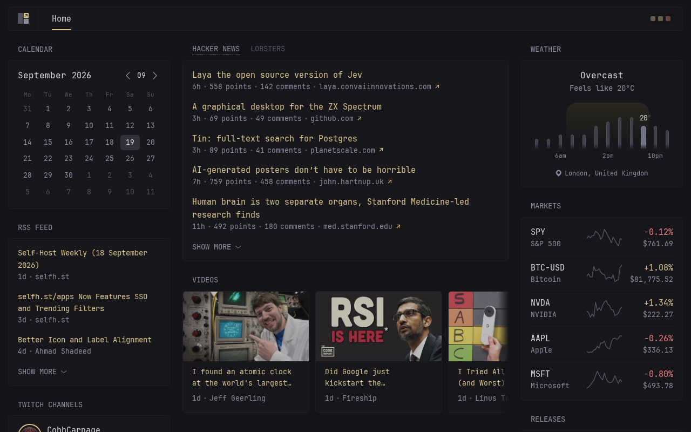

# Glance Chrome

Your [Glance](https://github.com/glanceapp/glance) dashboard as the Chrome new tab page.

Glance Chrome is an unofficial port of Glance, the self-hosted feed dashboard, to a Manifest V3 browser extension. It reuses Glance's own CSS, JS and widgets and re-implements the server side (config parsing, templating, data fetching) in the browser, so there is no server or Docker container to run. Not affiliated with or endorsed by the Glance project.

## Features

- Every new tab is your Glance dashboard: RSS, Reddit, Hacker News, weather, YouTube, Twitch, markets, custom API widgets and more.
- Uses the same `glance.yml` format as upstream Glance, with themes, multiple pages and layouts. See the [configuration docs](docs/configuration.md#configuring-glance).
- Supports `${ENV}` and `${secret:name}` substitution and `!include` files, all set in the Options page.
- Fully local: config lives in `chrome.storage` and widgets fetch directly from your browser. No servers, no analytics. See [PRIVACY.md](PRIVACY.md).

## Install

From the Chrome Web Store: *(link once published)*.

From source:

    cd extension && ./build.sh
    # chrome://extensions > Developer mode > Load unpacked > extension/dist

Then open the extension's Options page, upload your `glance.yml`, add any env vars, secrets and `!include` files, and Save.

To package for the Web Store: `cd extension && ./build.sh && (cd dist && zip -r ../glance-chrome.zip .)`

## Limitations

Some server-side features can't work in a browser:

- Docker unix socket: use an http(s) docker-socket-proxy URL in `sock-path`.
- `server-stats` with `type: local`: use `type: remote` with a Glance agent.
- `allow-insecure` TLS and per-request `proxy`.

## Permissions

- `storage`: saves your config locally.
- `<all_urls>`: widgets fetch the feeds and APIs you configure, on arbitrary hosts.
- `declarativeNetRequest`: strips extension-identifying request headers on requests to reddit.com, which otherwise rejects them.

## Repository layout

- `extension/`: the extension (this project's code) and its `build.sh`.
- `internal/`, `pkg/`, `docs/`: upstream Glance source and docs. The extension copies its static assets at build time.

## License

Source: https://github.com/ebrahimHakimuddin/glance-extension. AGPL-3.0, same as upstream Glance. See [LICENSE](LICENSE) and [NOTICE](NOTICE).
